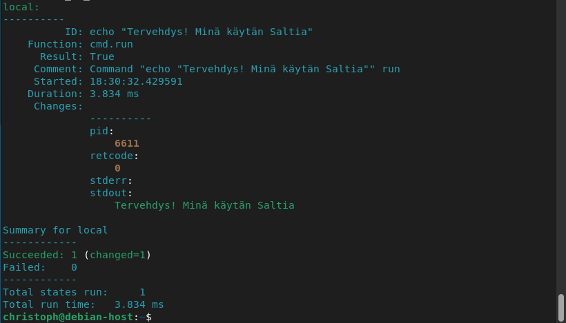

# h1 Viisikko


## Salt minionin asennus
Tarvitsemme `wget` työkalun, jotta voimme lataa tarvittavat tiedostot, kuten sources.list, jotta voimme asentaa Saltin.

```bash
sudo apt update
sudo apt install wget

```
seuraavaksi luodaan uusi kansio, johon voimme lataa tarvittavat tiedostot:

```bash
mkdir saltrepo/
cd saltrepo/

```
Komento `mkdir` luo meille uuden kansion ja komennolla `cd` vaihdetaan kansio aktiiviseksi

Nyt voimme ajaa komennot

```bash
wget https://packages.broadcom.com/artifactory/api/security/keypair/SaltProjectKey/public
wget https://github.com/saltstack/salt-install-guide/releases/latest/download/salt.sources

```
Saltin APT repositorio täytyy lisätä pakettivarastoon ja PGP avain täytyy listätä keyringiin käyttämällä `cp` eli `copy` komentoa

```bash
sudo cp public /etc/apt/keyrings/salt-archive-keyring.pgp
sudo cp salt.sources /etc/apt/sources.list.d/
```

Nyt voimme asentaa Saltin seuraavilla komennoilla:

```bash
sudo apt-get update
sudo apt-get install salt-minion salt-master
```
Ensimmäinen komento päivittää pakettivaraston ja toinen komento asentaa koneelle `salt-minion` sekä `salt-master` ohjelmat.

Voimme tarkastaa että asennus onnistui käyttäen komentoa
```bash
salt --version
```
joka tulostaa meille versiotiedot:


## Saltin tilafunktiot

### pkg
`pkg` avulla voidaan varmistaa että jokin ohjelmistopaketti on asennettu, poistettu tai päivitetty. Voimme esimerkiksi tarkastaa että `nano`-editori on asennettuna.
```bash
sudo salt-call --local -l info state.single pkg.installed nano
```


Koska `nano` oli jo asennettuna koneella, saamme tuloksena takaisin "True" ja operaatio onnistui. Voimme väliaikaisesti poistaa `nanon` komennolla ja ajaa asennuskomento uudestaan
```bash
sudo salt-call --local -l info state.single pkg.removed nano
sudo salt-call --local -l info state.single pkg.installed nano
```


Tulostuksessa lukee nyt "Succeeded: 1 (changed=1)", eli muutos on tapahtunut. Jos nano olisi ollut vielä asennettuna, lukisi tulosteessa vain "Succeeded: 1", sillä komento tarkasti vain että se on asennettuna ja ei pitänyt asentaa uudestaan.

### file

`file` tilafunktion avulla voidaan hallita tiedostoja. Esimerkkinä voimme tarkastaa onko tiedosto nimeltä `esimerkki.txt` olemassa `tmp` kansiossa. Tähän käytämme komentoa:
```bash
sudo salt-call --local -l info file.file_exists /tmp/esimerkki.txt
```


Komento palauttaa vastauksena `False`, eli tekstitiedostoa ei löydy kyseisestä paikasta. Nyt luomme `nanon` avulla kyseinen tekstitiedosto ja ajetaan komento uudelleen.


Tällä kertaa komento palauttaa `True` eli tiedosto on olemassa.


### service

`Service` tilafunktion avulla voimme hallita tietokoneella olevien palvelujen tilaa sekä palvelujen automaattista käynnistämistä. Esimerkkinä voimme testata, onko `cron` ajastuspalvelu päällä:

```bash
sudo salt-call --local state.single service.running cron
```


Vaihtoehtoisesti voimme pysäyttää sen ja sen jälkeen koittaa uudestaan onko `cron` käynnissä ja jos ei, niin automaattisesti käynnistää sen:
```bash
sudo salt-call --local state.single service.dead cron
sudo salt-call --local state.single service.running cron
```


Salt huomasi että `cron`ei ole enää käynnissä ja käynnisti sen uudelleen.
### user
`user` tilafunktiolla voidaan hallita käyttäjätilejä järjestelmässä. Esimerkkinä luomme uuden testikäyttäjän nimeltä Testiteppo. Tämä onnistuu seuraavalla komennolla:
```bash
sudo salt-call --local -l info state.single user.present Testiteppo
```
Salt tarkasti onko kyseinen käyttäjä jo olemassa, jonka jälkeen se luotiin.


Komennolla 
```bash
cat /etc/passwd

```
voimme tarkastaa että käyttäjä luotiin.


Tässä voimme myös testata idempotenssia. Jos käyttäjä `Testiteppo` on jo olemassa, komento rullaa läpi, mutta muutoksia ei tapahdu.

Käyttäjää ei vielä ole, joten Salt luo käyttäjän (huomioi (changed=1)):


Käyttäjä on jo olemassa, komento rullaa läpi onnistuneesti, mutta ilman muutoksia:

### cmd

`cmd` eli command tilafunktion avulla voimme suorittaa eri komentoja komentorivillä
Voimme esimerkiksi lähettää tervehdyskomennon Saltin avulla:
```bash
sudo salt-call --local -l info state.single cmd.run 'echo "Tervehdys! Minä käytän Saltia"'
```


`Result: True` kertoo meille että komento onnistui ja `Succeeded: 1 (changed=1)` kertoo että yksi tila onnistui ja yksi muutos toteutettiin.
