# h2 Infraa koodina

## Sisällysluettelo

- [x Tiivistelmät](#x-tiivistelmät)
- [a Hei Infrakoodi](#a-hei-infrakoodi)
- [b Topping](#b-topping)
- [c Viisikko tiedostossa](#c-viisikko-tiedostossa)
- [d SLS-tiedosto joka käyttää tekemiämme tiloja](#d-sls-tiedosto-joka-käyttää-tekemiämme-tiloja)
- [Lähteet](#lähteet)


## x Tiivistelmät

### Karvinen 2014: Hello Salt Infra-as-Code

- Asenna Salt
- Luo kansio moduulille
- Tee ```init.sls``` tiedosto ja kirjoita infraa koodina
- Aja koodi
- Jos koodin ajaa useamman kerran,ei tapahdu muutoksia, eli idempotenssi toteutuu

### Rules of YAML
- Saltin oletusreneröijä
- Välilyönnit sisennyksissä (2 ja 4)
- Komennot alkavat ```#``` merkillä
- Tieto esitetään ```key:value``` pareina

### Salt contributors: The top file

- ```top.sls``` määrittelee mitä tilafunktioita mihinkin koneiden ryhmään käytetään
- Yhdistää kolme asiaa: ```state tree```, ```target``` ja ```state files```


## a Hei Infrakoodi

Tehtävän tarkoitus on kokeilla paikallisesti infraa koodina tekemällä sls-tiedoston, joka tekee esimerkkitiedoston /tmp/ kansioon. 

Ensimmäisenä ajoin komennon 
```bash 
sudo nano heiinfrakoodi.sls
```
avautuneeseen editoriin kirjoitin kuvassa näkyvät tiedot

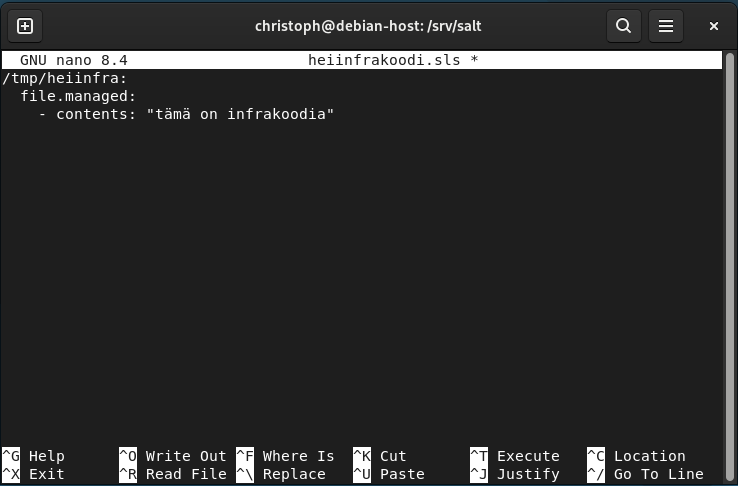)

ja poistuin tallennettuani juuri luodun ´´´heiinfrakoodi.sls´´´ tiedoston.

Seuraavaksi siirryin testaamaan, toimiiko juuri tehty tiedosto.
```bash 
sudo salt-call --local state.apply heiinfrakoodi
```
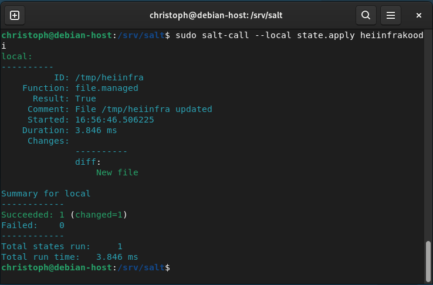)

Palautuksen mukaan komento onnistui ja koska tiedostoa ei ollut vielä olemassa, lukee palautuksessa "Succeeded 1 (changed=1)". Jos nyt ajaisimme komennon uudestaan, menisi komento läpi uudelleen, mutta koska tiedosto on jo olemassa, ei tapahtuisi muutosta ja palautuksessa lukisi vain "Succeeded 1".

## b Topping

Tämän tehtävän tarkoitus oli luoda top-file joka ajaa kaikki tilat yhdellä komennolla. Komennolla 

```bash 
sudo nano top.sls
```
loin ```top.sls``` nimisen tiedoston ja lisäsin siihen kuvassa näkyvät tiedot

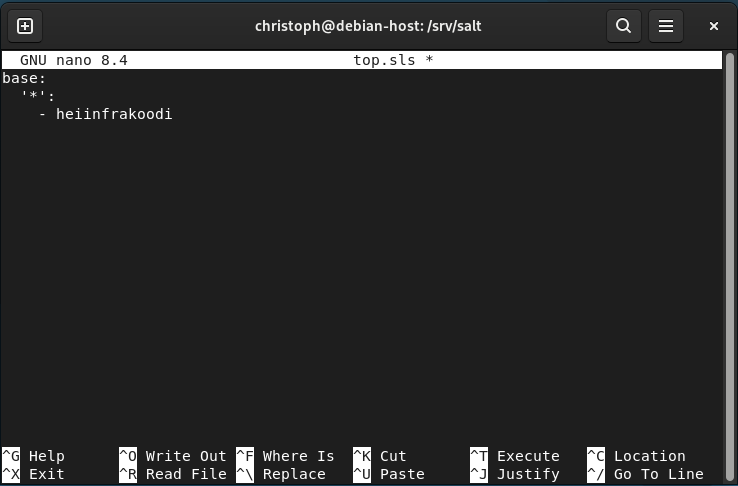)

```top.sls``` tiedoston pitäisi nyt aina kun se ajetaan, ajaa tila ```heiinfrakoodi``` kaikilla minioneilla.

Testasin toimiiko ```top.sls``` tiedosto komennolla

```bash 
sudo salt-call --local state.apply
```
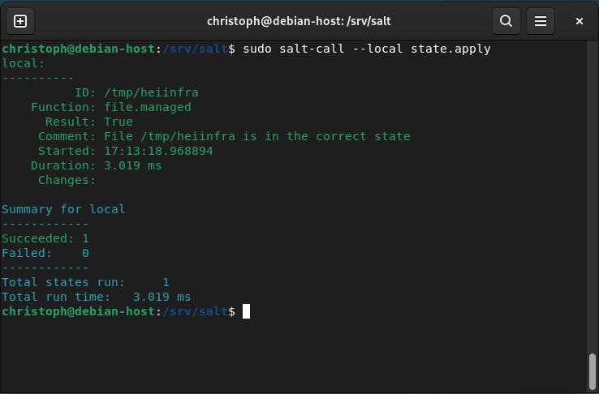)


## c Viisikko tiedostossa

Tehtävää varten loin ```mkdir``` komennolla kansiot ```hellopkg```, ```hellofile```, ```helloservice```, ```hellouser```, ```hellocmd``` ja loin jokaiseen oman ```init.sls``` tiedoston.

```/srv/salt/hellopkg/init.sls```
Asentaa ```nano```-editorin, jos sitä ei ole asennettuna
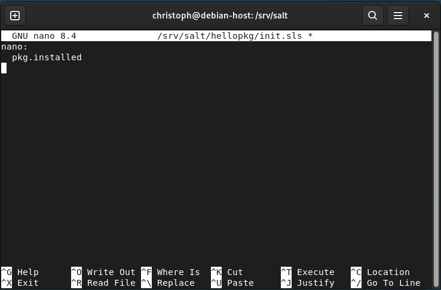)

```/srv/salt/hellofile/init.sls```
Luo tekstitiedoston ```/tmp/``` kansioon
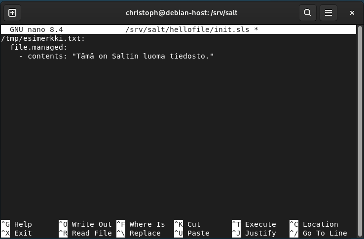)

```/srv/salt/helloservice/init.sls```
Tarkastaa onko ```cron``` asennettuna
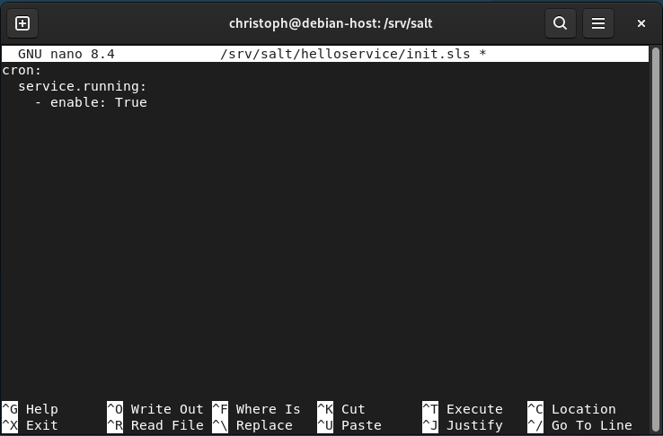)

```/srv/salt/hellouser/init.sls```
Luo käyttäjän ```Testiteppo``` jos sitä ei vielä ole
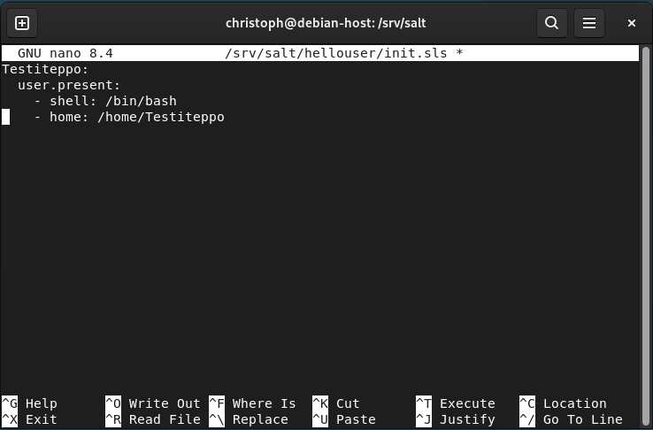)

```/srv/salt/hellocmd/init.sls```
Suorittaa tervehdyksen ja tallentaa sen erilliseen tiedostoon
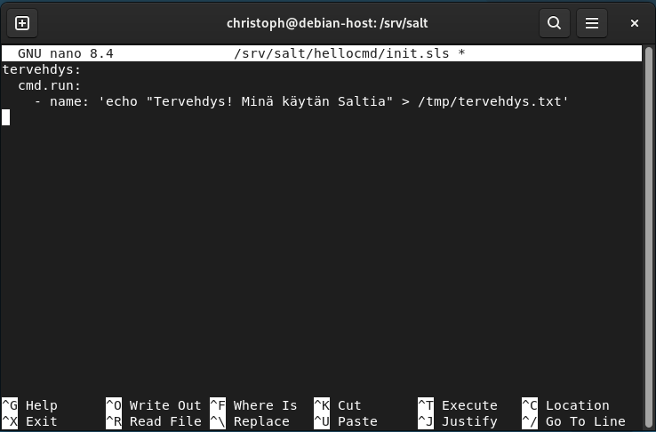)

## d SLS-tiedosto joka käyttää tekemiämme tiloja

Tiedosto käyttää ```pkg.installed```, ```service.running``` ja ```user.present``` tilafunktioita
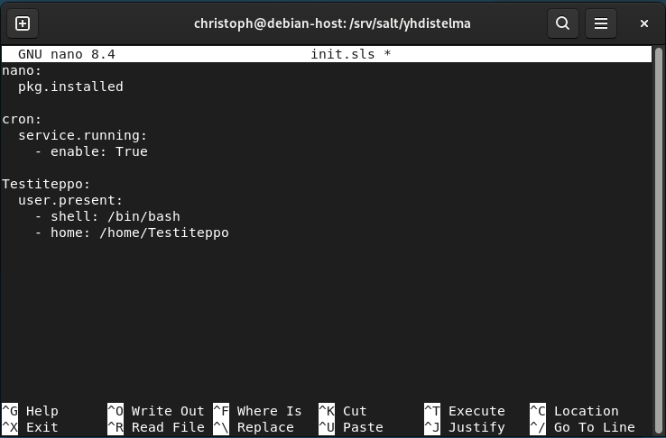)

Testatakseen toimiiko juuri tekemä filu
```bash 
sudo salt-call --local state.apply /srv/salt/yhdistelma.sls

```
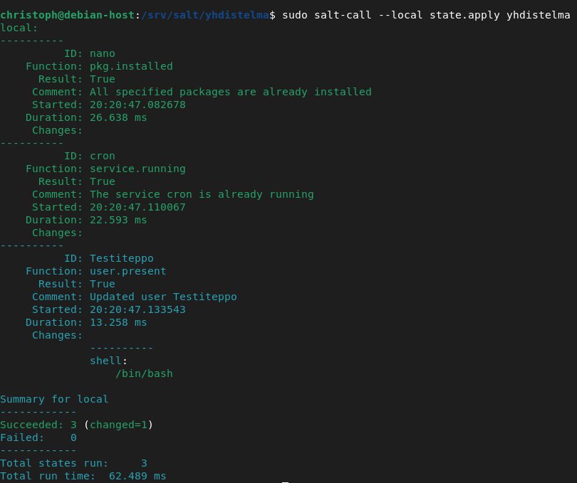)

Poistin testikäyttäjän ```Testiteppo``` ja pysäytin ```cron```-palvelun, minkä jälkeen ajoin tilan ```yhdistelma``` uudelleen. Salt suoritti tarvittavat muutokset (käyttäjän luonti ja cronin käynnistäminen). Suoritettuani tilan vielä toisen kerran, Salt havaitsi, että kaikki oli jo kunnossa, eikä uusia muutoksia tehty. Tämä osoittaa, että tila on idempotentti.

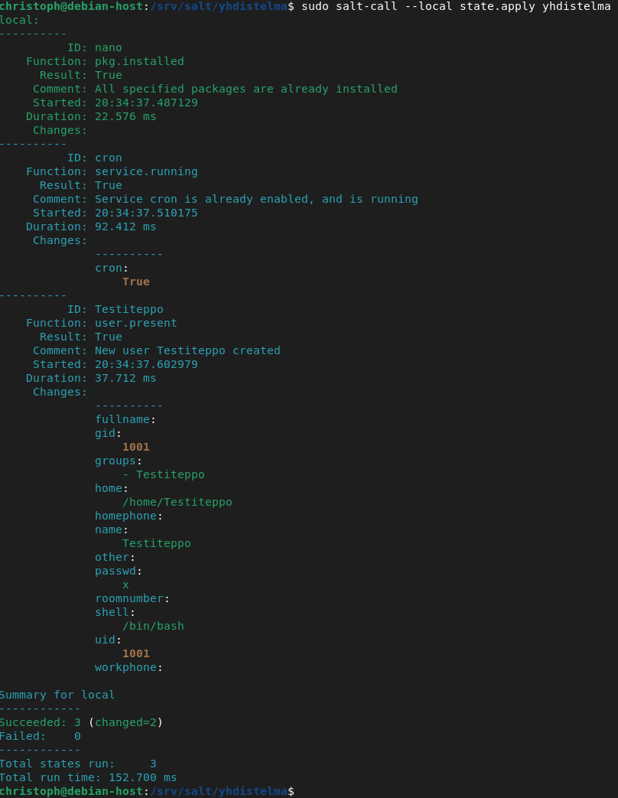)

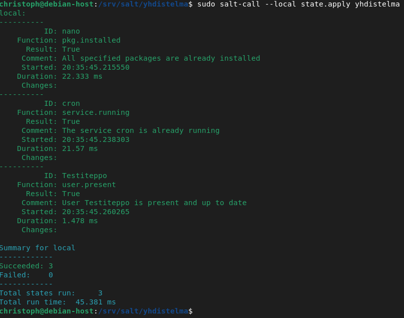)

## Lähteet

- Karvinen, Tero (2024): *Hello Salt Infra-as-Code*.  
  [https://terokarvinen.com/2024/hello-salt-infra-as-code/](https://terokarvinen.com/2024/hello-salt-infra-as-code/)

- Salt contributors: *Salt overview*.  
  [https://docs.saltproject.io/salt/user-guide/en/latest/topics/overview.html#rules-of-yaml](https://docs.saltproject.io/salt/user-guide/en/latest/topics/overview.html#rules-of-yaml)

- Salt contributors: *The Top File*.  
  [https://docs.saltproject.io/en/latest/ref/states/top.html](https://docs.saltproject.io/en/latest/ref/states/top.html)
