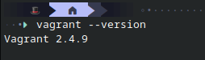
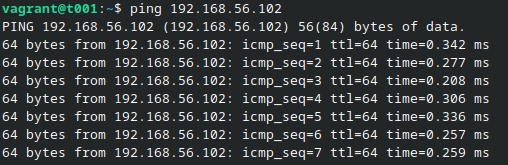
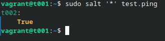
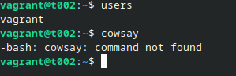
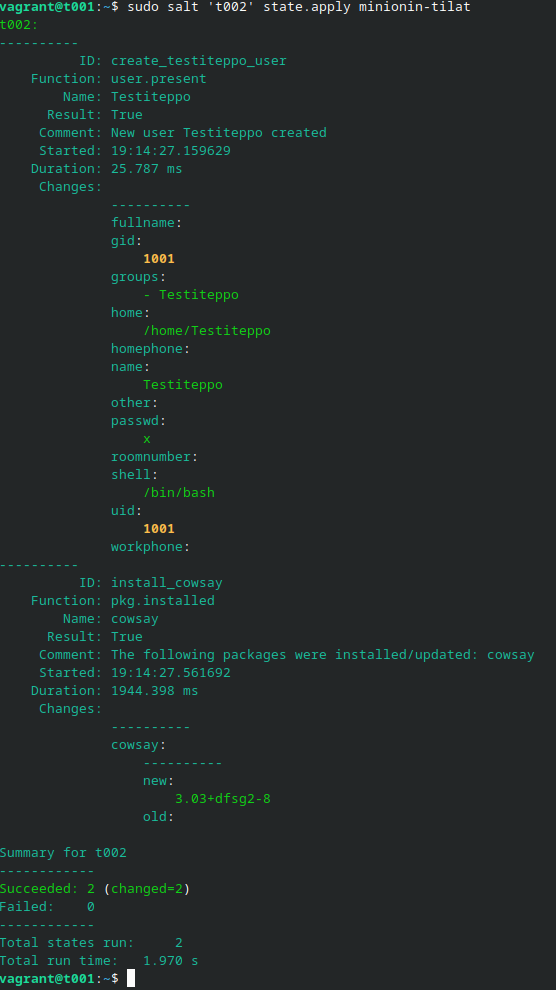
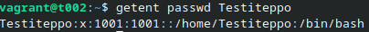
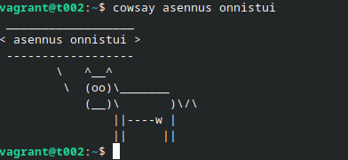

# h3 soitto kotiin

## Sisällysluettelo

- [x Tiivistelmät](#x-tiivistelmät)
- [a Hello Vagrant!](#a-hello-vagrant)
- [b Linux Vagrant](#b-linux-vagrant)
- [c Kahden verkko](#c-kahden-verkko)
- [d Herra-orja verkossa](#d-herra-orja-verkossa)
- [e tilat verkon yli](#e-tilat-verkon-yli)
- [Lähteet](#lähteet)


## x Tiivistelmät

**[Two Machine Virtual Network With Debian 11 Bullseye and Vagrant](https://terokarvinen.com/2021/two-machine-virtual-network-with-debian-11-bullseye-and-vagrant/)**
- Asenna Vagrant  ```sudo apt-get install vagrant virtualbox```
- Tee Vagrantfile 
- Määrittele virtuaalikoneet tiedostoon
- Käytä ssh yhteyttä yhdistäessä
- ```vagrant destroy``` tuhoaa virtuaalikoneet


**[Salt Quickstart – Salt Stack Master and Slave on Ubuntu Linux](https://terokarvinen.com/2018/03/28/salt-quickstart-salt-stack-master-and-slave-on-ubuntu-linux/)**
- Asenna Master (ohjaaja)
- Asenna Slave (minion)
- Hyväksy minionin avain
- Testaile eri komentoja


**[Salt Vagrant - automatically provision one master and two slaves](https://terokarvinen.com/2023/salt-vagrant/)**
- Luo kansio ja tiedosto hallinnointia varten
- Luo top.sls topfile
- Aja komennolla ```sudo salt '*' state.apply```


## a Hello Vagrant

Käytin Vagrantin virallista Fedora 42 -asennusohjetta, koska käyttämäni Nobara Linux -jakelu pohjautuu Fedoraan ja asensin Vagrantin [virallisten ohjeiden](https://developer.hashicorp.com/vagrant/downloads) mukaisesti. 

Testasin onnistuiko asennus käyttäen komentoa:
```bash 
vagrant --version
```



## b Linux Vagrant

Loin ```mkdir``` komennolla uuden kansion projekteille johon loin ```nanon``` avulla uuden tekstitiedoston nimeltä ```vagrantfile```. 

Tähän tiedostoon laitoin seuraavat tiedot:
```bash 
  
$tscript = <<TSCRIPT
set -o verbose
apt-get update
apt-get -y install tree
echo "Done - set up test environment"
TSCRIPT

Vagrant.configure("2") do |config|
  config.vm.box = "debian/testing64" 
  config.vm.synced_folder ".", "/vagrant", disabled: true
  config.vm.synced_folder "shared/", "/home/vagrant/shared", create: true
  config.vm.provision "shell", inline: $tscript

  config.vm.define "t001" do |t001|
    t001.vm.hostname = "t001"
    t001.vm.network "private_network", ip: "192.168.56.101"
  end

  config.vm.define "t002", primary: true do |t002|
    t002.vm.hostname = "t002"
    t002.vm.network "private_network", ip: "192.168.56.102"
  end
end

```
Kun tämän tiedoston sisällön ajaa Vagrantin avulla, pitäisi Vagrant luoda kaksi uutta virtuaalikonetta nimeltä "t001" ja "t002". Testasin toimiiko tämä navigoimalla sinne mihin tekstitiedoston loin ja käyttämällä komentoa 
```bash 
vagrant up
```
Vagrant lähti asentamaan kahta uutta virtuaalikonetta ja asennuksen jälkeen pääsin koittamaan, onnistuiko asennus käyttämällä komentoa: 
```bash 
vagrant ssh t001
```
SSH yhteys onnistui, joten virtuaalikoneet luotiin.

## c Kahden verkko

Kummallekin koneelle oli jo määritelty P-osoite samaan aliverkkoon (t001 192.168.56.101, t002 192.168.56.102) aiemman tehtävän yhteydessä joten pääsin heti testaamaan onnistuiko myös verkottaminen käyttämällä ```ping``` komentoa luoduilla virtuaalikoneilla.

Pingasin t001 virtuaalikoneesta t002 virtuaalikonetta onnistuneesti. Koneet ovat siis samassa verkossa.
```bash 
ping 192.168.56.102
```


## d herra-orja verkossa

Salt masterin asennus ```t001``` virtuaalikoneelle

```bash 
vagrant ssh t001
sudo apt-get update
sudo apt-get install salt-master
```

Salt minionin asennus ```t002``` virtuaalikoneelle

```bash 
vagrant ssh t002
sudo apt-get update
sudo apt-get install salt-minion
```
masterin IP lisääminen minionille:
```bash 
sudo nano /etc/salt/minion
```
jonne lisätään ```master: 192.168.56.101```

Avainten hyväksymisen jälkeen virtuaalikoneella ```t001``` käytin Saltin ping komentoa nähdäkseni pystynkö ohjaamaan nyt minionia masterilta.



## e tilat verkon yli

Tätä varten loin master koneella t001 ```minionin-tilat.sls```tekstitiedoston johon laitoin seuraavat tiedot: 

```bash 
  GNU nano 8.4                                             /srv/salt/minionin-tilat.sls                                                      
create_testiteppo_user:
  user.present:
    - name: Testiteppo
    - shell: /bin/bash

install_cowsay:
  pkg.installed:
    - name: cowsay

```

Käyttäjää ```Testiteppo``` eikä ohjelmaa ```Cowsay``` löydy minionilta. 

Kun tiedosto ajetaan, sen pitäisi asentaa ```Testiteppo``` niminen käyttäjä minioneilla, sekä asentaa ```cowsay``` paketin.

Tarkastin ensin nykytilan, että voin verrata sitä myöhemmin kun olen ajanut komennon.



Käyttäjää ```Testiteppo``` eikä ohjelmaa ```Cowsay``` löydy minionilta. 

Masterilla t001 käytin komentoa

```bash 
sudo salt 't002' state.apply minionin-tilat
```



Tämän jälkeen tarkastin vielä minionilta että onnistuiko käyttäjän luonti ja ohjelman asennus







## Lähteet

   
