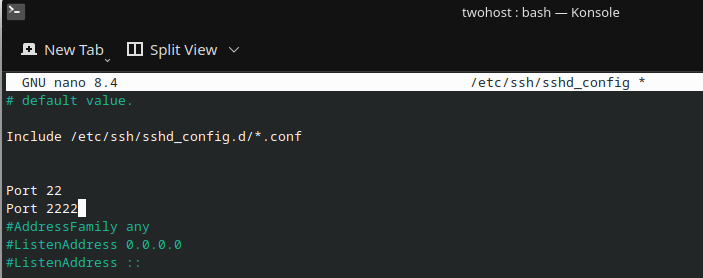
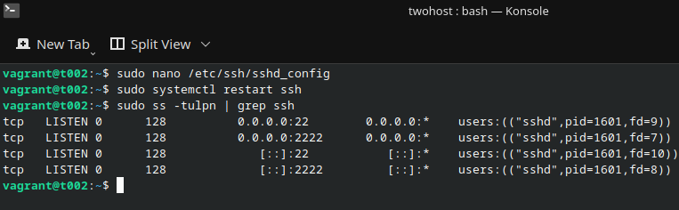
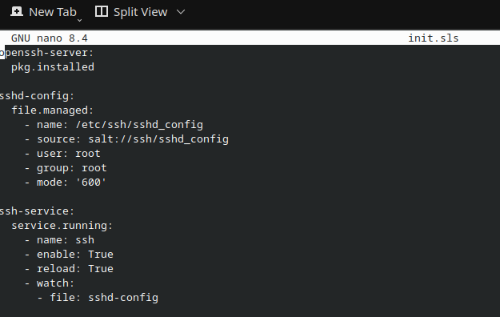
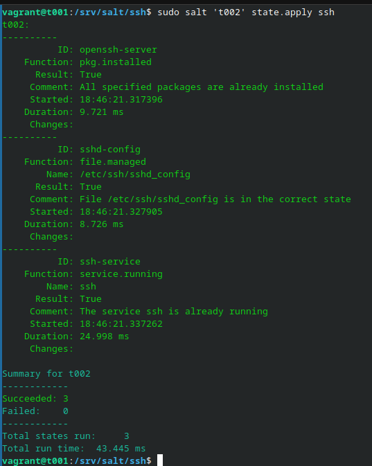
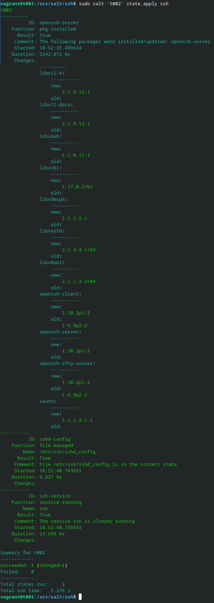

# h4 Pkg-file-service


## Lue ja tiivistele
[Karvinen 2018: Pkg-File-Service – Control Daemons with Salt – Change SSH Server Port](https://terokarvinen.com/2018/04/03/pkg-file-service-control-daemons-with-salt-change-ssh-server-port/?fromSearch=karvinen%20salt%20ssh)

- Pkg asentaa tarvittavan paketin
- File hallitsee konfiguraatio
- Service käynnistää ja watch uudelleenkäynnistää jos tiedoston sisältö muuttuu

Kirjauduin minionille ```t002```

```bash 
vagrant ssh t002
sudo nano /etc/ssh/sshd_config
```
Lisäsin SSH portit configiin ja uudelleenkäynnistin ```ssh```


```bash 
sudo systemctl restart ssh

```


Seuraavaksi siirryin masterille ```t001``` ja loin uuden kansion ```ssh``` jonne loin ```nanolla``` tiedoston ```init.sls``` ja loin ```/etc/ssh/sshd_config``` tiedoston.




Nyt ajoin tekemäni tiedoston komennolla

```bash 
sudo salt 't002' state.apply ssh
```


Komento meni läpi ja mikään ei epäonnistunut. Tarvittavat tiedostot ovat jo olemassa, joten asia tarkastetaan vain. Seuraavaksi kirjauduin takaisin ```t002``` minionille ja poistin ```openssh-server```, jonka jälkeen ajoin tilan uudestaan.



## Lähteet

## Lähteet

- Karvinen, Tero (2018): *Pkg-File-Service – Control Daemons with Salt – Change SSH Server Port*.  
[https://terokarvinen.com/2018/04/03/pkg-file-service-control-daemons-with-salt-change-ssh-server-port/?fromSearch=karvinen%20salt%20ssh](https://terokarvinen.com/2018/salt-quickstart-salt-stack-master-and-slave-on-ubuntu-linux/)


