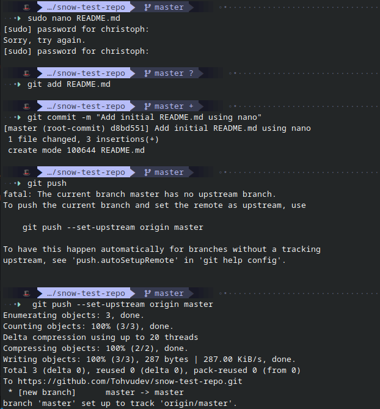
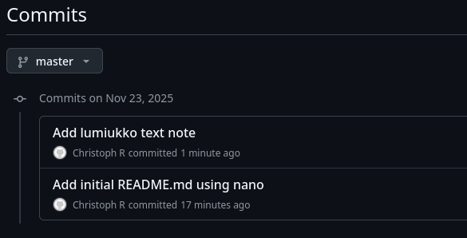
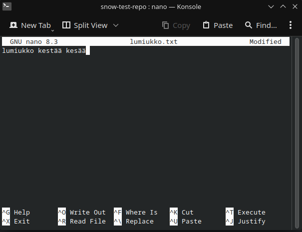
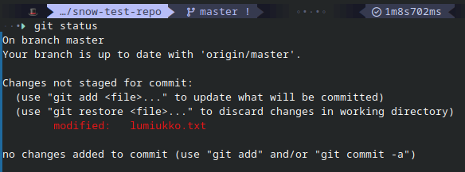
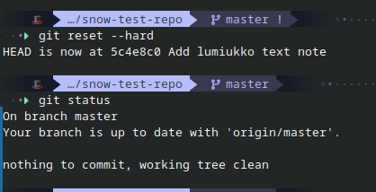
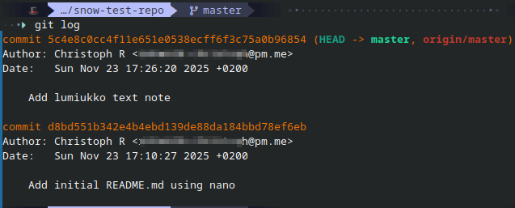
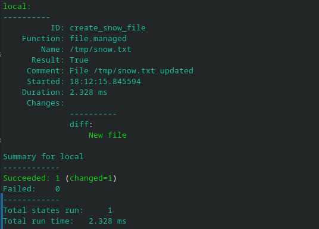

# h5 Toimiva versio

## x) Lue ja tiivistä

- Git on versionhallintajärjestelmä
- Komentoja kuten git add, git pull, git commit
- Tallentaa projektit snapshotteina
- Kolme tiedoston tilaa: modified, staged ja committed

- git add . lisää kaikki muutokset 
- git commit luo uuden commitin
- git pull hakee viimeset muutokset reposta
- git push lähettää paikalliset muutokset repoon


### a)

Päätin kokeilla tehtävän suorittamiseen GitHubin omaa komentoriviohjelmaa. Asensin sen ensiksi [täältä](https://github.com/cli/cli/blob/trunk/docs/install_linux.md#rpm) löytyvien ohjeiden avulla. Minulla on käytössä fedorapohjainen kone, joten asennuskomennot minulla olivat:

```bash
sudo dnf install dnf5-plugins
sudo dnf config-manager addrepo --from-repofile=https://cli.github.com/packages/rpm/gh-cli.repo
sudo dnf install gh --repo gh-cli
```

Seuraavaksi käytin komentoa
```bash
gh auth login
```

ja menin kirjautumisprosessin läpi ja yhdistin Github käyttäjän CLI työkaluun.
Oman miniprojektin aihetta kannattaa jo haudutella, ja ehkä kokeillakin.

Päätin tehdä uuden repon nimeltä "snow-testi-repo". Tämä onnistui seuraavalla komennolla 

```bash
gh repo create snow-test-repo \
  --description "this is a testrepo about snow" \
  --public \
  --clone

```
```--clone``` komento kopioi heti repositoryn koneelleni.

Navigoin kloonattuun kansioon ja loin sisälle ```README.md``` tiedoston jonka heti committasin.

```bash
sudo nano README.md
git add README.md
git commit -m "Add initial README.md using nano"
git push --set-upstream origin master


```



### b)

Kloonasin repon koneelleni jo edellisessä kohdassa, mutta testasin kanssa kloonata komennoilla:


```bash
git clone https://github.com/Tohvudev/snow-test-repo
cd snow-test-repo

```
Kansioon lisäsin nyt kloonauksen jälkeen uuden tekstitiedoston nimeltä ```lumiukko.txt```. Tiedoston heti committasin ja pushasin githubiin.

```bash
nano lumiukko.txt
git add lumiukko.txt
git commit -m "Add lumiukko text note"
git push
```
Tämän jälkeen vielä menin Githubins sivulle tarkastamaan että commitin on ilmestynyt sinne ja kuten kuvassa näkyy, muutokset ilmestyivät myös webbiin



### c)

Avasin ```lumiukko.txt``` tiedoston nanossa ja muokkasin sitä saadakseni huonon muutoksen aikaan.



Tämän jälkeen tarkistin git statuksen



Nyt pystyin ajamaan komennon joka poistaa muutokset jonka jälkeen taas sama git status komento

```bash
git reset --hard
git status
```



### d)

```bash
git log
```
Komennon avulla kävin tarkastamassa logitiedoston. ```HEAD``` on uusin repoon tapahtunut commit ja commitin tekijä näkyy logissa. Logissa näkyy myös aika milloin committi suoritettiin ja commitin kuvaus. Ensin on luotu ```README.md``` ja sen jälkeen lisätty 
```lumiukko.txt```



### e)

Lisäsin repoon kansion ```srv``` jonka sisälle tein kansion ```salt```. ```salt``` kansioon loin ```top.sls``` ja ```snow.sls``` tiedostot. 

#### ```top.sls``` 

```bash
base:
  '*':
    - snow

```

#### ```snow.sls``` 

```bash
create_snow_file:
  file.managed:
    - name: /tmp/snow.txt
    - contents: "Tämä on testi snow tiedostosta"

```

Tämän jälkeen lisäsin tiedostot gitiin ja pushasin muutokset nettiin. Seuraavaksi käytin komentoa:

```bash
sudo salt-call --local --file-root srv/salt/ state.apply

```
Tila suoritettiin onnistuneesti ja yksi tiedosto luotiin.



## Lähteet

- Chacon, Scott & Straub, Ben (2014): *Pro Git*, 2nd edition.
  <https://git-scm.com/book/en/v2>

- Karvinen, Tero (2024): *Suolax repository*.
  <https://github.com/terokarvinen/suolax/>

- GitHub Docs (2025): *Using Git*. 
  <https://docs.github.com/en/get-started/using-git>

- GitHub CLI Contributors (2025): *GitHub CLI*.
  <https://github.com/cli/cli>

- Karvinen, Tero (2025): *Palvelinten Hallinta*.
  <https://github.com/cli/cli](https://terokarvinen.com/palvelinten-hallinta/#h5-toimiva-versio>
